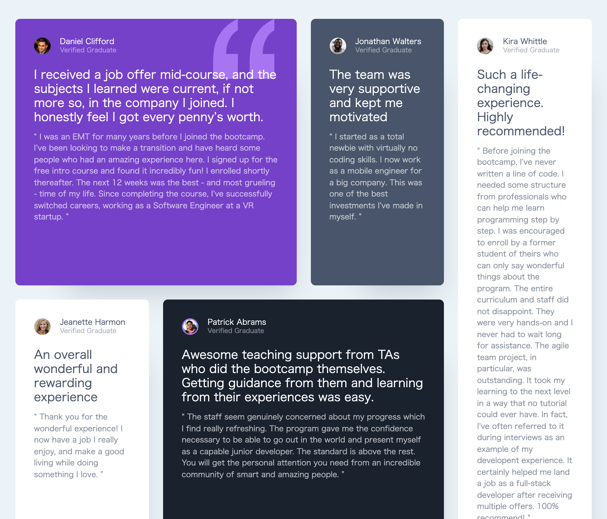

# CSS-Grid-the-easy-way

<h4>CreatedAt:3th Dec 2021</h4> 

## ScreenShot of the project

##For Desktop

## Detail of the project

This is CSS Grid Web Design Course in Youtube.

https://www.youtube.com/watch?v=rg7Fvvl3taU

## Purpose of the project

Get the knowledge of CSS Grid Fundamentals

## Demo

https://hiros-dev.github.io/CSS-Grid-the-easy-way/

## What did I learn from this project?

How to use CSS Grid

How to design Simple Web Layout

How to design Responsive Layout with CSS Grid

Thank you for reading. And, happy coding!!!
